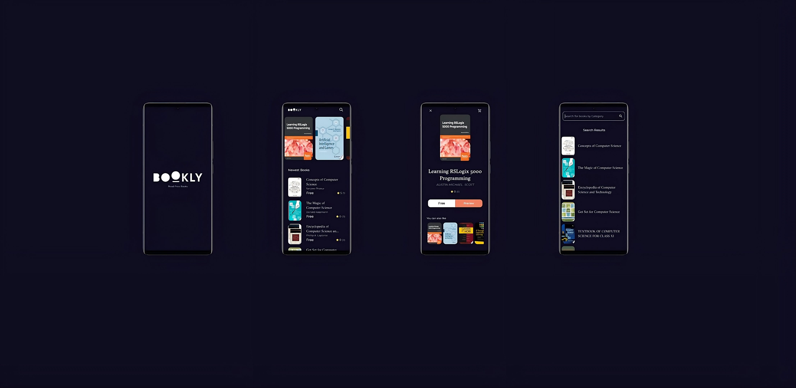

# 📚 Bookly – Read Free Books

A modern mobile app for discovering and exploring books, featuring:

- ✨ Personalized recommendations
- 🆕 Newest releases
- 📖 Detailed book information
- 🔍 Powerful search functionality

<p align="center">
  
</p>

## 🎨 Views

🖼️ 1. Splash View:
- Displays the app logo “BOOKLY”.
- Shows tagline “Read Free Books.”
- Acts as an the app’s introductory screen before navigating to the main home view.

<p align="left">
  
</p>

##

🏠 2. Home View:
- Top App Bar: displays the Bookly logo and a search icon.
- Newest Books Section: vertically scrollable list of recently added books with their titles and “Free” price labels.
- Recommended Books Carousel: horizontally scrollable cards displaying book covers and titles.
- Uses a dark minimalist theme consistent with the splash view.

<p align="left">
  
</p>

##

📖 3. Book Details View:
- Displays the book cover, title, and author name.
- Shows the book price (e.g., “Free”) and a Preview button to read a sample.
- Includes a “You can also like” section suggesting related books.
  
<p align="left">
  
</p>

##

🔍 4. Search Results View
- Features a search bar at the top labeled “Search for books by Category.”
- Displays a scrollable list of results with each item showing:
 - Book cover image.
 - Book title.
 - Author info (or “No Author”).
 - Price label (e.g., “Free”)


<p align="left">
  
</p>


## 🛠️ Tech Stack

📱 Frontend
- Framework: Flutter
- State Management: Bloc

🌐 Backend
- API: [Rest API]
  

## 🏗️ Architecture
- 🧩 MVVM pattern
- 📡 REST API integration

```
lib/
│
├── core/
│   ├── errors/               # Custom exceptions, failures, and error handling logic
│   ├── services/             # App-wide services (API, local storage, Firebase, etc.)
│   ├── functions/            # General helper functions (formatting, validation, dialogs, etc.)
│   ├── utils/                # Global utilities (router, constants, theme, styles, etc.)
│   ├── widgets/              # Shared/reusable UI components (buttons, loaders, error widgets)
│
├── features/
│   ├── home/                 
│   │   ├── data/             # Data layer (models, repositories, data sources)
│   │   │   ├── models/
│   │   │   └── repos/
│   │   └── presentation/     # UI layer (cubits, views, widgets)
│   │       ├── manager/
│   │       ├── views/
│   │       └── widgets/
│   │
│   ├── details/
│   │   └── presentation/
│   │       ├── views/
│   │       └── widgets/
│   │
│   ├── search/
│   │   ├── data/
│   │   │   └── repos/
│   │   └── presentation/
│   │       ├── manager/
│   │       ├── views/
│   │       └── widgets/
│   │
│   └── splash/
│       └── presentation/
│           └── views/
│
├── main.dart                 # App entry point
│
│
assets/
└── images/                   # App images and icons
```

**Key Points:**
- **core/**: Common utilities and widgets used across features.
- **features/**: Each feature is isolated with its own data and presentation layers.
- **presentation/manager/**: State management (Cubit/BLoC).
- **presentation/views/**: Screens/pages.
- **presentation/widgets/**: UI components for each feature.
- **assets/**: Static resources.

This structure is scalable and easy to maintain as your app grows.
