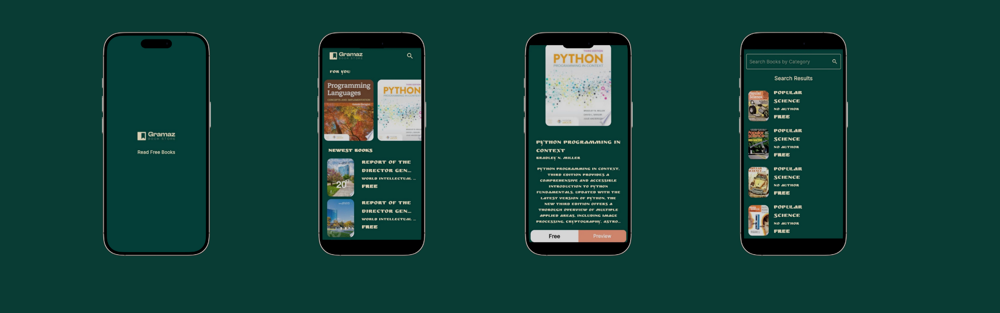
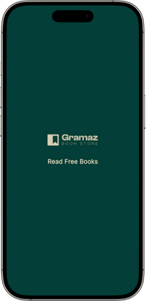
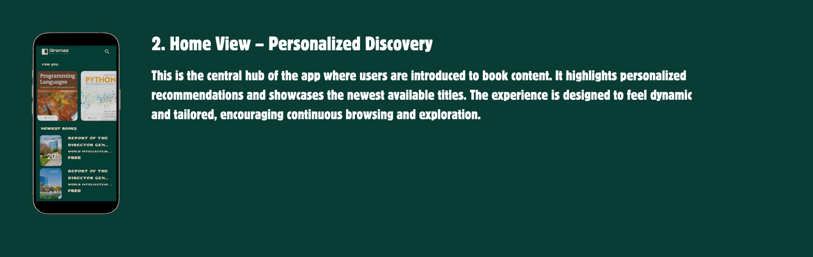
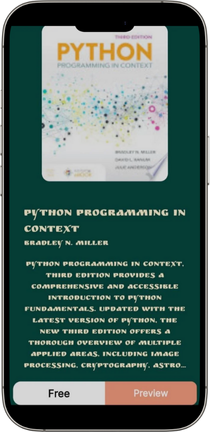
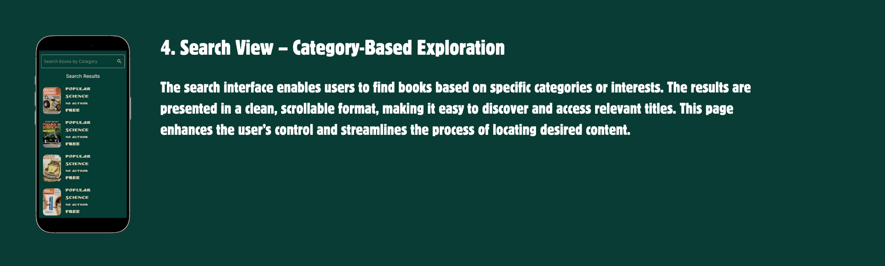

# 📚 Gramaz Book Store

A modern mobile app for discovering and exploring books, featuring:

- ✨ Personalized recommendations
- 🆕 Newest releases
- 📖 Detailed book information
- 🔍 Powerful search functionality

<p align="center">
  
</p>

## 🎨 Views

🖼️ 1. Splash View:
- Displays the app logo (“Gramaz Book Store”).
- Shows tagline: “Read Free Books”.
- Acts as an intro screen before navigating to the main home view.

<p align="left">
  
</p>

##

🏠 2. Home View:
- Top App Bar: shows the Gramaz logo and a search icon.
- Section “For You”: horizontally scrollable list of recommended books with cover images and titles.
- Section “Newest Books”: vertically scrollable list of recently added books with truncated titles and price tags (“Free”).
- Dark theme consistent with splash screen colors.

<p align="left">
  
</p>

##

📖 3. Book Details View:
- Shows book cover image at the top.
- Displays book title and author name below.
- Contains a brief book description giving an overview of the content.
- Bottom has two buttons:
- Free (possibly for reading)
- Preview (to view a sample).
  
<p align="left">
  
</p>

##

🔍 4. Search Results View discover specific books from the vast collection:
- Search bar at the top labeled “Search Books by Category.”
- Displays search results list with each item showing:
 - Book cover image.
 - Book title (e.g., Popular Science).
 - Author info (or “No Author”).
 - Price label (“Free”).


<p align="left">
  
</p>


## 🛠️ Tech Stack

📱 Frontend
- Framework: Flutter
- State Management: Bloc

🌐 Backend
- API: [Rest API]
  

## 🏗️ Architecture
- 🧩 MVVM pattern
- 📡 REST API integration

```
lib/
│
├── core/
│   ├── utils/                # App-wide utilities (router, styles, helpers, etc.)
│   ├── widgets/              # Shared/reusable UI components
│
├── features/
│   ├── home/                 
│   │   ├── data/             # Data layer (models, repositories, data sources)
│   │   │   ├── models/
│   │   │   └── repos/
│   │   └── presentation/     # UI layer (cubits, views, widgets)
│   │       ├── manager/
│   │       ├── views/
│   │       └── widgets/
│   │
│   ├── details/
│   │   └── presentation/
│   │       ├── views/
│   │       └── widgets/
│   │
│   ├── search/
│   │   ├── data/
│   │   │   └── repos/
│   │   └── presentation/
│   │       ├── manager/
│   │       ├── views/
│   │       └── widgets/
│   │
│   └── splash/
│       └── presentation/
│           └── views/
│
├── main.dart                 # App entry point
│
assets/
└── images/                   # App images and icons
```

**Key Points:**
- **core/**: Common utilities and widgets used across features.
- **features/**: Each feature is isolated with its own data and presentation layers.
- **presentation/manager/**: State management (Cubit/BLoC).
- **presentation/views/**: Screens/pages.
- **presentation/widgets/**: UI components for each feature.
- **assets/**: Static resources.

This structure is scalable and easy to maintain as your app grows.
