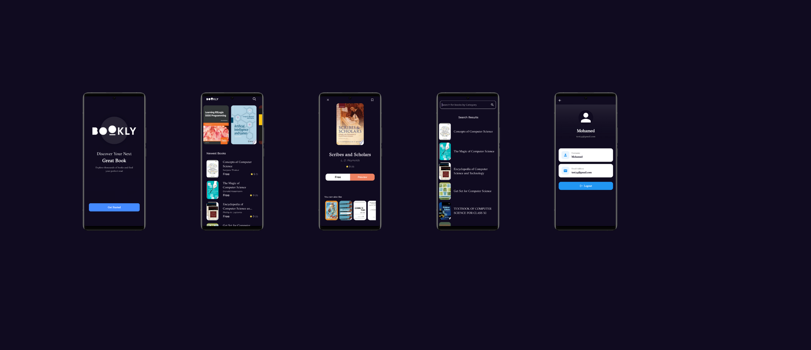
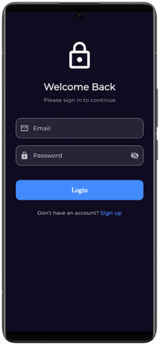
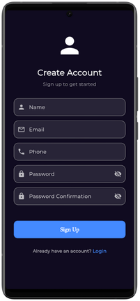
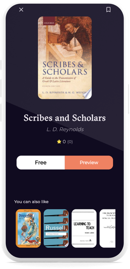
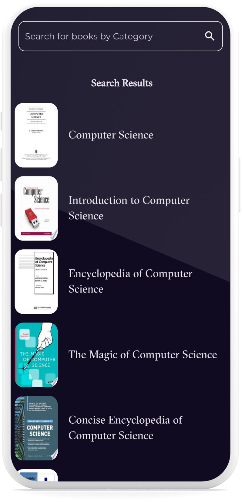
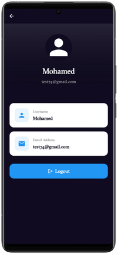

# 📚 Bookly – Read Free Books

A modern mobile app for discovering and exploring books, featuring:

- ✨ Personalized recommendations
- 🆕 Newest releases
- 📖 Detailed book information
- 🔍 Powerful search functionality

<p align="center">
  
</p>

## 🎨 Views

🖼️ **Onboarding View:**
- Displays the app logo “BOOKLY”.
- Introduces the app’s value proposition with the text “Discover Your Next Great Book”.
- Provides a “Get Started” button to proceed into the app.
- Acts as the first onboarding step before navigating to the home view.

<p align="left">
  
</p>

##

🔐 **Login View:**                                                                                                                                  
  - 📧 Allows registered users to sign in using Email and Password                                                                                  
  - 🆕 “Sign-up” navigation button for new users                                                                                               
  - ✅ On successful login, users are directed to the Home View                                                                                  
                                                                                                                                                   
  <p align="left">  </p>                                                
  
##

📝 **Sign-Up View:**                                                                                                                                
  - 📝 Enables new users to create an account by entering: Name, Email, Phone, Password, and Confirm Password                                       
  - ✅ On successful sign-up, users are directed to the Login View                                                                                
  - ↩️ "Already have an account?" option                                                                                                            
  - ➡️ "Login" navigation button                                                                                                                  
                                                                                                                                                   
  <p align="left">                                                                                                                                 
                                                                       
</p>                                                                                                                                               

##

🏠 **Home View:**
- Top App Bar: displays the BOOKLY logo, a menu icon that opens a navigation drawer, and a search icon for quick access to books.
- Navigation Drawer: accessible from the menu icon and includes a Profile option for user-related actions.
- Recommended Books Section: horizontally scrollable carousel showcasing highlighted and recommended books with their covers and titles.
- Newest Books Section: vertically scrollable list of recently added books, showing book covers, titles, ratings, and “Free” price labels.


<p align="left">
  
</p>

##

📖 **Book Details View:**
- Displays the book cover, title, and author name.
- Shows the book price (e.g., “Free”) and a Preview button to read a sample.
- Includes a “You can also like” section suggesting related books.
  
<p align="left">
  
</p>

##

🔍 **Search View:**
- Features a search bar at the top labeled “Search for books by Category.”
- Displays a scrollable list of results with each item showing:
 - Book cover image.
 - Book title.
 - Author info (or “No Author”).
 - Price label (e.g., “Free”)


<p align="left">
  
</p>

##                                                                                                                                                 
                                                                                                                                                   
👤 **Profile View:**                                                                                                                                
  - 🪪 Displays user info, including Name and Email                                                                                                 
  - 🚪 Includes a Logout button for secure sign-out                                                                                                 
                                                                                                                                                   
<p align="left">                                                                                                                                   
                                                                       
</p>                                                                                                                                               


## 🛠️ Tech Stack

📱 Frontend
- Framework: Flutter
- State Management: Bloc

🌐 Backend
- API: [Rest API]
  

## 🏗️ Architecture
- 🧩 MVVM pattern
- 📡 REST API integration

```
lib/
│
├── core/
│   ├── errors/               # Custom exceptions, failures, and error handling logic
│   ├── services/             # App-wide services (API, local storage, Firebase, etc.)
│   ├── functions/            # General helper functions (formatting, validation, dialogs, etc.)
│   ├── utils/                # Global utilities (router, constants, theme, styles, etc.)
│   ├── widgets/              # Shared/reusable UI components (buttons, loaders, error widgets)
│
├── features/
│   ├── home/                 
│   │   ├── data/             # Data layer (models, repositories, data sources)
│   │   │   ├── models/
│   │   │   └── repos/
│   │   └── presentation/     # UI layer (cubits, views, widgets)
│   │       ├── manager/
│   │       ├── views/
│   │       └── widgets/
│   │
│   ├── details/
│   │   └── presentation/
│   │       ├── views/
│   │       └── widgets/
│   │
│   ├── search/
│   │   ├── data/
│   │   │   └── repos/
│   │   └── presentation/
│   │       ├── manager/
│   │       ├── views/
│   │       └── widgets/
│   │
│   └── splash/
│       └── presentation/
│           └── views/
│
├── main.dart                 # App entry point
│
│
assets/
└── images/                   # App images and icons
```

**Key Points:**
- **core/**: Common utilities and widgets used across features.
- **features/**: Each feature is isolated with its own data and presentation layers.
- **presentation/manager/**: State management (Cubit/BLoC).
- **presentation/views/**: Screens/pages.
- **presentation/widgets/**: UI components for each feature.
- **assets/**: Static resources.

This structure is scalable and easy to maintain as your app grows.
